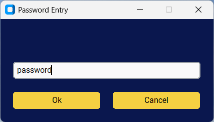
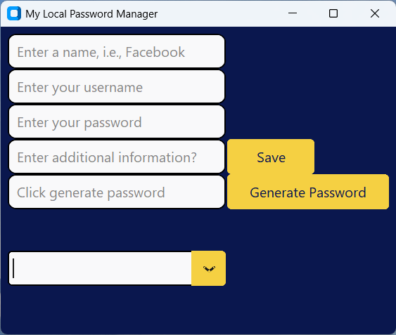
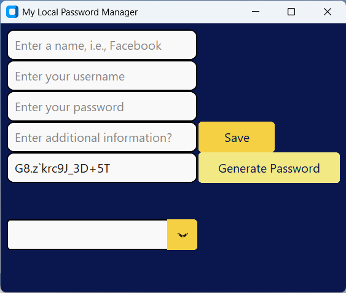
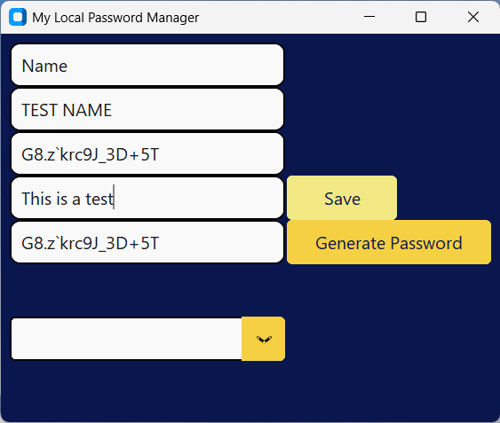
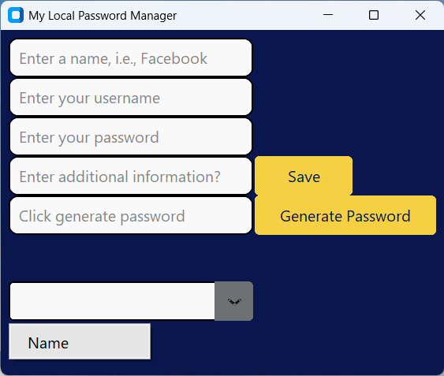
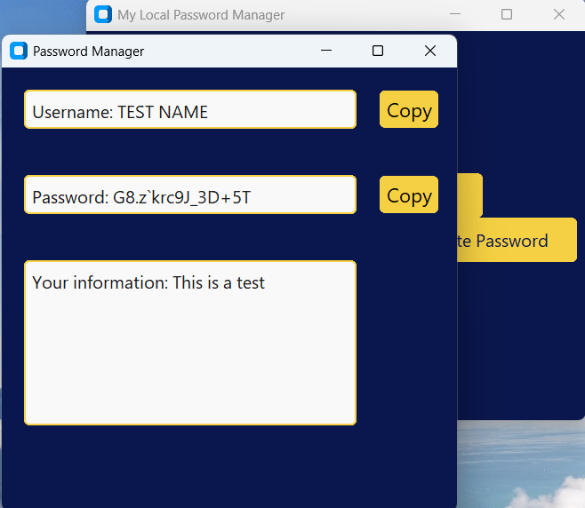

# Local Password Manager

A local desktop password manager built using Python, CustomTkinter and SQLite.

This project was created as a practical application of Python programming concepts, including object-oriented programming, GUI development, database management and user interaction workflows.

## Project Overview

The application allows users to:

- Create and store login information locally
- Generate strong random passwords
- Retrieve previously saved credentials
- Copy usernames and passwords to the clipboard
- Manage stored information through a graphical interface

The project currently focuses on application structure, GUI design and local database interaction. Future versions will introduce additional security features, including password hashing and encryption.

## Features

### Graphical User Interface

Built using CustomTkinter, providing:

- Main application window
- Password entry system
- Credential input forms
- Credential retrieval popup window
- Interactive buttons and dropdown menus

### Password Generator

The application includes a password generator which creates strong random passwords for users.

### Local Database Storage

Credentials are stored using SQLite.

The application uses:

- SQL queries for saving and retrieving information
- A database manager class to handle database operations
- Separate classes for GUI and database functionality

### Credential Retrieval

Users can select saved credentials from a dropdown menu and view their stored information in a separate popup window.

### Clipboard Functionality

Username and password information can be copied directly to the clipboard using Pyperclip.

## Screenshots

### 1. Application Login

### 2. Main Application Window

### 3. Password Generator

### 4. Saving Credential Information

### 5. Retrieving Saved Credentials

### 6. Retrieved Credential Information

## Technologies Used

- Python
- CustomTkinter
- SQLite
- Pyperclip

## Future Improvements

Planned improvements include:

- Master password authentication
- Password hashing
- Symmetric encryption for stored credentials
- Improved database security
- Additional user interface improvements

## Learning Outcomes

Through this project I have developed experience with:

- Object-oriented programming in Python
- Designing GUI applications
- Connecting Python applications to databases
- Managing application state
- Passing data between classes
- Structuring a larger Python project

