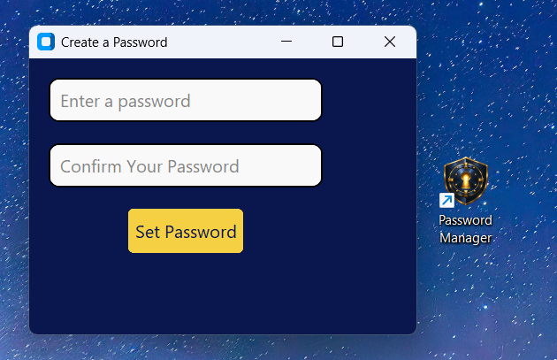
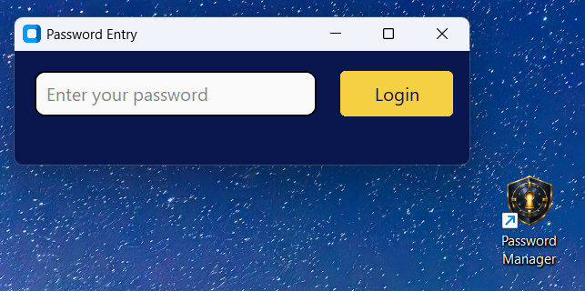
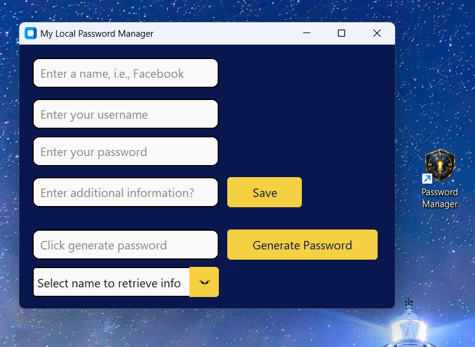
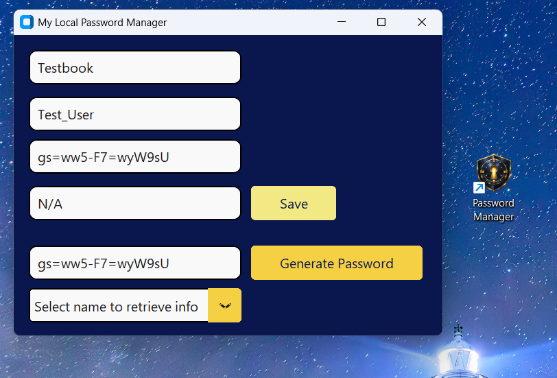
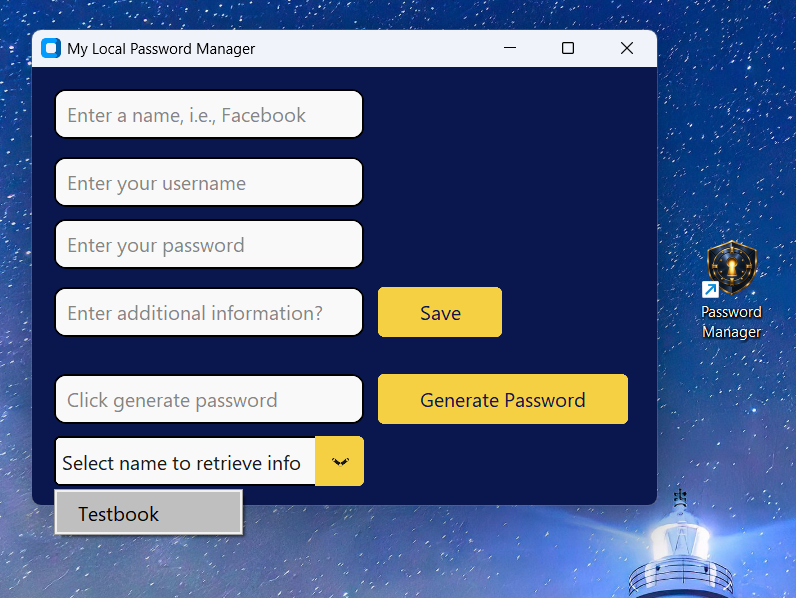
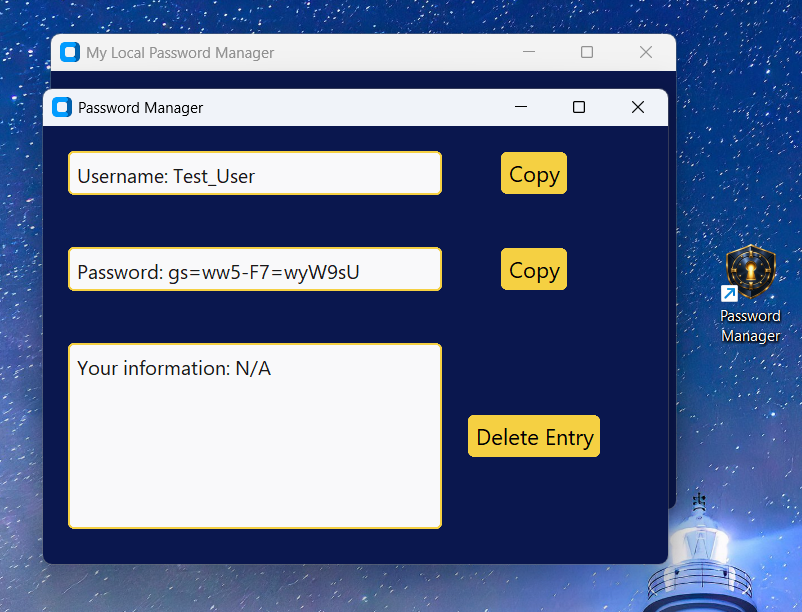
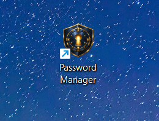

# Local Password Manager

This local password manager was developed in Python using CustomTkinter, SQLite and the Cryptography library. The application provides master password authentication, local credential storage/retrieval, with the SQLite database encrypted between sessions, and password generation.

The project has also been packaged as a Windows desktop application and as a portable application within PortaLab, a USB containing several Python-based projects and scripts.

## Project Purpose

The password manager was developed as a practical learning project, intended to bring together Python concepts learnt through smaller projects. This included object-oriented programming, GUI development, encryption/decryption and working with a local SQLite database.

Its scope included exploring the security considerations required to store credentials locally, for example, password hashing, salting, key derivation and symmetric encryption, all of which were explored separately first, before being implemented into the application. This allowed the underlying processes to be understood before they became part of the wider program.

The completed project also provided an opportunity to work through problems that became apparent as the application grew, particularly the management of multiple GUI windows, passing objects and data between classes, application state, file paths and the order in which different parts of the program are initialised and closed.

## Features

The application provides a graphical interface for creating, storing and retrieving login information. On first launch, the user is prompted to create a master password. On subsequent launches, that password is then required before access to the main application is provided.

Credentials can be entered manually and stored alongside a name and additional information. A password generator is also included, producing 16-character passwords from uppercase and lowercase letters, numbers and symbols using Python's `secrets` module.

Stored entries are available from a dropdown menu in the main application. Selecting an entry opens a separate information window where the username, password and additional information can be viewed. Usernames and passwords can be copied directly to the clipboard, while individual records can also be deleted from the database.

## Comprehensive Application Walkthrough

### 1. First Launch and Master Password Creation

When the application is run for the first time, the user is prompted to create and confirm a master password. The password is not stored directly. Instead, a salt is generated and the password is hashed using scrypt. The resulting hash and salt are stored for use during future authentication.



### 2. Password Entry

On subsequent launches, the application detects the existing password hash and salt and displays the password entry window. The supplied password is hashed using the stored salt and compared with the existing hash before access is provided.



### 3. Main Application

Following authentication, the main application provides fields for a credential name, username, password and any additional information. Existing passwords can be entered directly or a new password can be produced using the built-in generator.



### 4. Saving Credentials

Credential information entered through the main window is passed to the database manager and stored in the local SQLite database. Once an entry has been saved, the retrieval dropdown is updated to include the newly stored name and the fields are refreshed.



### 5. Selecting Stored Information

Stored entries can be selected by name from the dropdown menu. The database is queried for the selected record and the result is passed to a separate information window.



### 6. Retrieving and Managing Credentials

The information window displays the username, password and additional information associated with the selected entry. The username and password can be copied to the clipboard independently. Records can also be deleted from this window, which is done by taking the current primary key from the particular row where the name was selected, since duplicate names are allowed. After deletion, the main application's list of available entries is updated immediately.



### 7. Desktop Application

The packaged application can be launched through a Windows desktop shortcut without requiring execution directly from a Python IDE.



## Architecture and Project Structure

The project was divided into a number of classes and modules, with each responsible for a particular area of the application.

`main.py` acts as the application's entry point and controls its overall lifecycle. It begins the authentication process, retains the authenticated password in memory for the active session, prepares the encrypted database for use, creates the database connection and then launches the main GUI. It also controls the shutdown process so that the database connection is closed before the database file is encrypted, and encryption takes place before shutdown.

`password_windows.py` manages the master password interface. It determines whether the files required for an existing master password are present and either opens the login window or asks the user to create a password on first launch.

`security_manager.py` contains the password hashing, password verification, key derivation and database encryption/decryption logic.

`database_manager.py` manages the SQLite connection and the operations used to create, save, retrieve and delete credential records.

`ctk_window.py` contains the main application window and coordinates interaction between the GUI, password generator, database and credential retrieval window.

`user_info_window.py` contains the popup used to display retrieved credentials. As this window is created as a child of the main application window, it can use the existing database relationship through its parent when deleting records rather than creating another database connection.

`password_generator.py` contains the password generation logic and uses `secrets.choice()` to generate passwords from the permitted character set.

### Project Structure

```text
Password Manager/
├── ctk_window.py
├── database_manager.py
├── main.py
├── password_generator.py
├── password_windows.py
├── security_manager.py
├── user_info_window.py
├── main.spec
├── Password Manager.spec
├── README.md
├── image/
└── password_manager_screenshots/
    ├── adding_to_db.png
    ├── desktop_shortcut.png
    ├── info_window.png
    ├── main_window.png
    ├── password_entry_window.png
    ├── selecting_info.png
    └── set_password_window.png
```

Runtime data, virtual environments, IDE configuration and build output are excluded from the repository through `.gitignore`.

## Authentication and Encryption

Two separate uses of scrypt are included within the application.

The master password is authenticated without storing the password itself. When a master password is created, a random 16-byte salt is generated using `secrets.token_bytes()`. The password is encoded and passed through scrypt with the salt, and the resulting hash is stored locally. During future login attempts, the supplied password is processed using the stored salt and the result is compared with the stored hash using `secrets.compare_digest()`.

The master password is also used as the basis for database encryption, which is why the correctly entered password is stored for the duration of the session. A separate salt is maintained for this purpose. Scrypt derives a 32-byte key from the authenticated password and encryption salt, which is then URL-safe Base64 encoded into a key suitable for Fernet.

The database is decrypted after successful authentication and before SQLite establishes its connection. Then, when the application is closed through the window, the database connection is closed first and the database file is encrypted using Fernet before the application exits.

Keeping authentication and database encryption as related but separate processes was an important part of the implementation. The stored password hash is used to determine whether the supplied master password is correct, while a key derived from that password is used for the separate purpose of encrypting and decrypting the database.

## Desktop and Portable Deployment

The project was developed beyond execution directly from a Python IDE and packaged as a Windows desktop application. The application determines its working directory differently depending on whether it is being executed from Python source or as a frozen executable, allowing its relative files and directories to remain accessible in either form, which is useful for general use and development.

A desktop shortcut can also be used to launch the packaged application in the same way as a conventional Windows program.

A portable version is also maintained within PortaLab. This allows the password manager to form part of the wider portable Python development environment without depending on the development machine's installed Python environment.

## Technologies Used

Python forms the main application language, with CustomTkinter used to construct the graphical interface and SQLite used for local structured storage.

The project also uses the Cryptography library for Fernet symmetric encryption, Python's `hashlib.scrypt` for password hashing and key derivation, `secrets` for cryptographically secure random values and password generation, Pyperclip for clipboard functionality, and `pathlib` for local file and directory handling. PyInstaller was also used to package the project as a Windows desktop application.

## Design Decisions and Learning Outcomes

The project became considerably more useful as a learning exercise as its individual parts began to interact. Early versions focused mainly on the GUI and database, while later development required consideration of the application's complete lifecycle. Encryption, for example, could not simply be added as an isolated function. The database had to be decrypted before SQLite attempted to access it, remain available while the application was running, have its connection closed correctly, and then be encrypted again when the application exited.

The project also helped develop a better understanding of the distinction between password hashing and encryption. Implementing the security logic involved working directly with salts, bytes, string encoding, derived keys and Base64 encoding; working through these concepts individually before implementation was very helpful.

Working with multiple CustomTkinter windows provided another useful learning point. Using the existing parent-child relationship between the main window and `CTkToplevel` allowed the information window to use the database object already owned by the main application. This avoided creating an unnecessary second database manager and helped clarify how objects already present within an application can be reused rather than recreated.

The password generator was also changed to use the `secrets` module rather than a general-purpose generator using the random module. Although a relatively small change in the wider project, it reinforced the importance of selecting tools according to the purpose for which generated values will be used.

Overall, the completed application brought together object-oriented programming, GUI development, relational data storage, cryptographic operations, file handling, application lifecycle management and desktop packaging within one project. However, there is still plenty of scope for further development and learning within this project.

## Future Development and Limitations

The present version encrypts the complete SQLite database between application sessions, i.e. on the deliberate closing event, rather than encrypting individual database fields while the application is running. As such, there is a known limitation that could be exposed if the machine running the application crashed, preventing the database from re-encrypting. Further development could explore alternative approaches to credential encryption and the handling of sensitive information while the application is active to mitigate these risks.

Other areas for future development include automated testing of database and cryptographic operations, additional validation around user input, and further refinement of the packaged application's installation and update process.

There are UI/UX considerations, too. For example, theme selection, confirmation windows for adding/deleting credentials, and password length/complexity configuration to name a few.

## Acknowledgements/Confessions

ChatGPT was used throughout development as a learning, discussion and debugging aid. Its use included explaining unfamiliar concepts, discussing implementation approaches and helping to diagnose problems encountered during development.